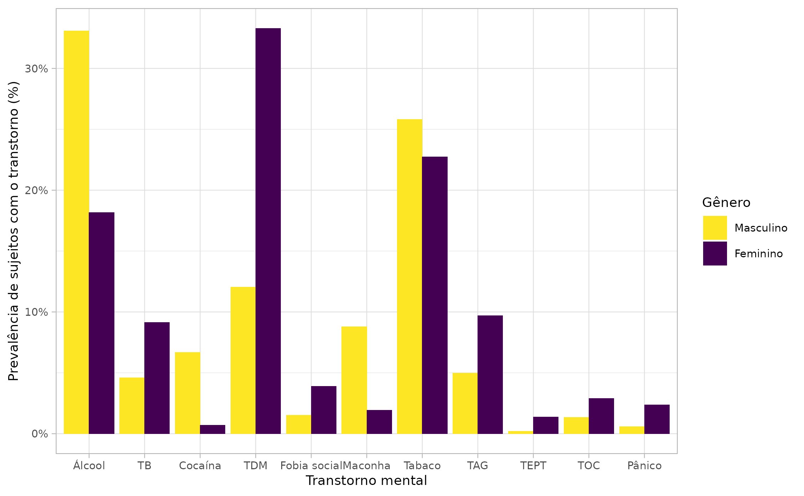
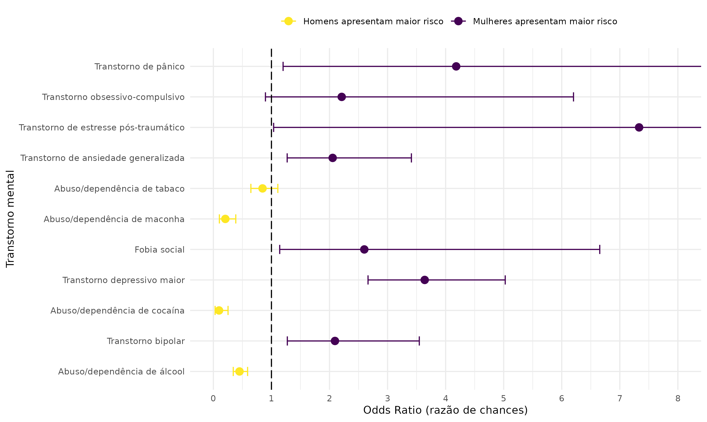

# Análise dos dados para Nieves (2021)

<!-- badges: start -->
<!-- badges: end -->

- O objetivo deste repositório é disponibilizar o script utilizado para análise dos dados do
resumo que será submetido ao Salão Universitário da Universidade Católica de Pelotas (UCPel)
do ano de 2021 pela acadêmica Maria Fernanda Nieves.

## Figuras finais para apresentação

### Figura 1. Frequência relativa de cada transtorno mental avaliado estratificado por gênero

### Figura 2. Odds ratio referentes a cada transtorno mental avaliado

