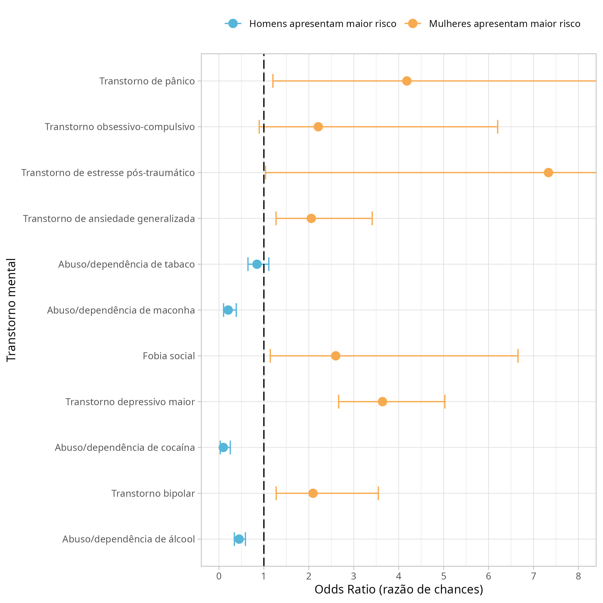

# Prevalência de transtornos mentais entre gêneros / Prevalence of mental disorders between genders 

<!-- badges: start -->
<!-- badges: end -->

- O objetivo deste repositório é disponibilizar o script utilizado para análise dos dados do
resumo que será submetido ao Salão Universitário da Universidade Católica de Pelotas (UCPel)
do ano de 2021 pela acadêmica Maria Fernanda Nieves.

- The purpose of this repository is to make available the script used to analyze the data that will be submitted to the "University Hall" of the Catholic University of Pelotas (UCPel) in 2021 by academic Maria Fernanda Nieves.

## Figuras para apresentação / Figures for presentation

### Figura 1. Frequência relativa de cada transtorno mental avaliado estratificado por gênero / Relative frequency of each mental disorder stratified by gender 

### Figura 2. Odds ratio referentes a cada transtorno mental avaliado / Odds ratio for each mental disorder

