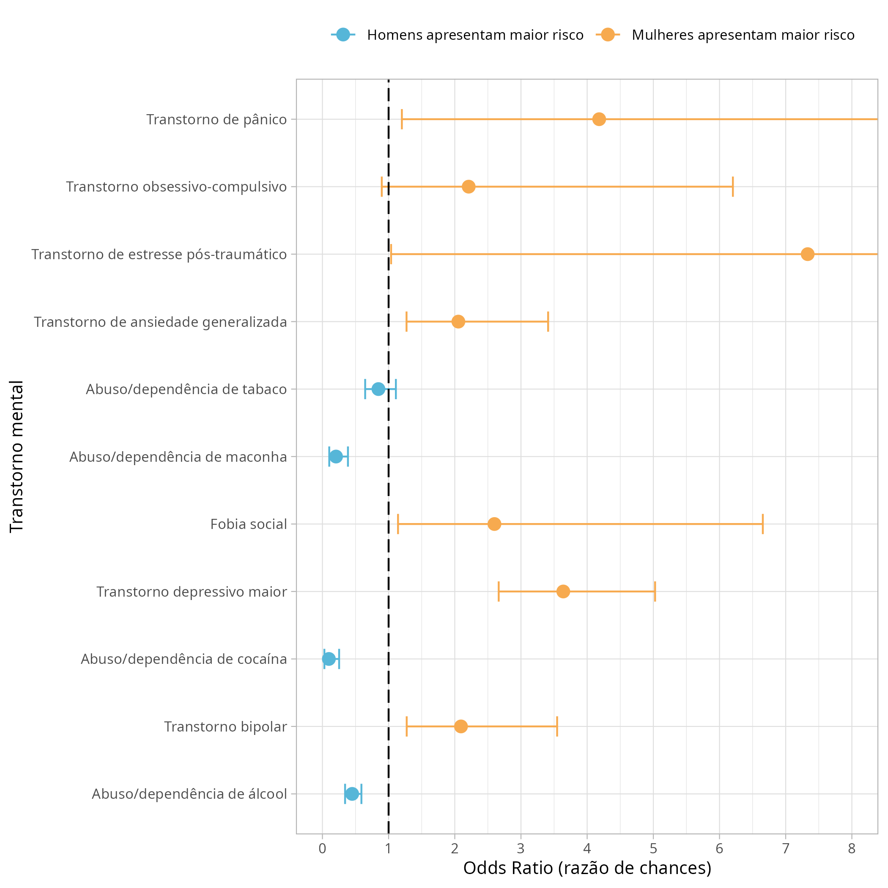

# Análise dos dados para Nieves (2021)

<!-- badges: start -->
<!-- badges: end -->

- O objetivo deste repositório é disponibilizar o script utilizado para análise dos dados do
resumo que será submetido ao Salão Universitário da Universidade Católica de Pelotas (UCPel)
do ano de 2021.

## Figuras finais para apresentação

